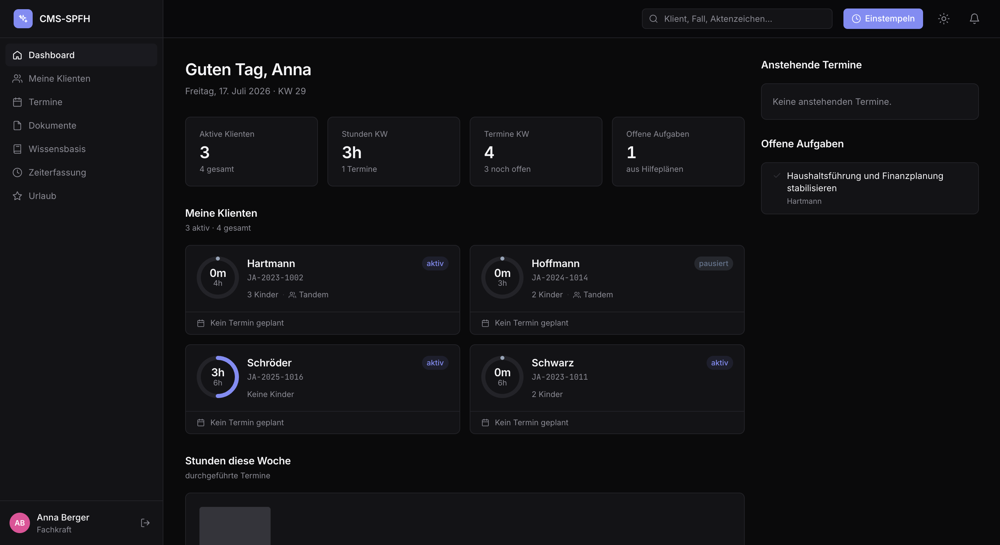
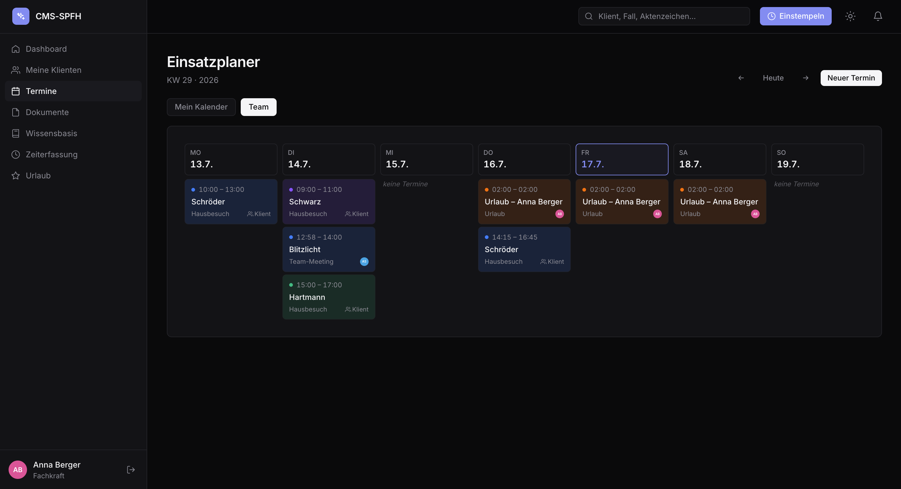
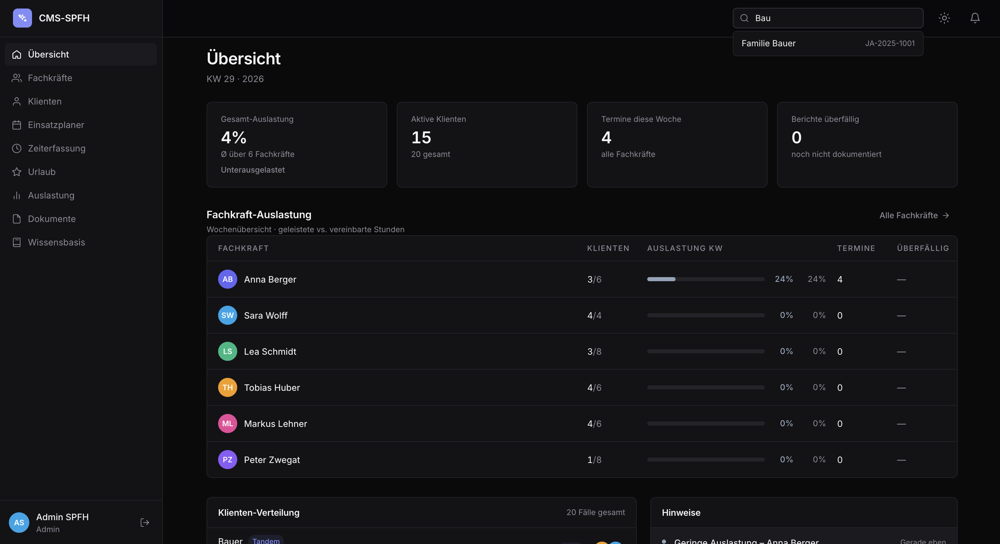
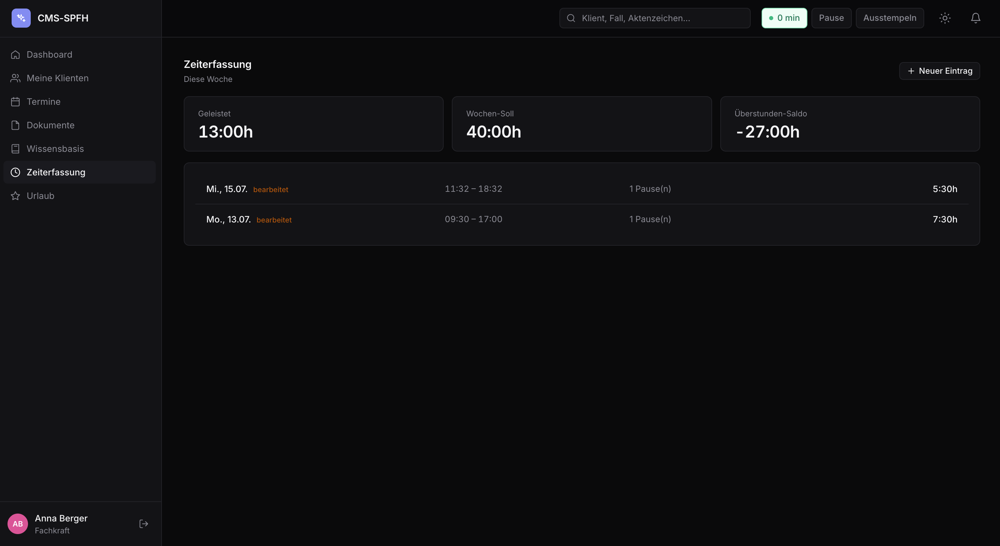

# SPFH CMS — Frontend

> React single-page app for a case-documentation platform used by **social
> family-care workers** (_Sozialpädagogische Familienhilfe_, SPFH). Workers see
> their assigned families, log appointments, upload reports, track working time and
> request vacation; admins oversee caseload, working-time and workload across the team.


Backend lives in [`../cms-backend`](../cms-backend).

---

## 🇩🇪 Kurzüberblick

React-Frontend für das **SPFH-Dokumentationssystem** (Sozialpädagogische
Familienhilfe). Fachkräfte sehen ihre zugewiesenen Familien, tragen Termine ein,
laden Berichte hoch, erfassen Arbeitszeit (Ein-/Ausstempeln) und beantragen Urlaub;
Admins behalten Auslastung, Zeiterfassung und Urlaube im Blick. Stack:
**React 19 + TypeScript, Vite, Tailwind v4, React Router v7**, mit einem eigenen
`fetch`-Wrapper (automatischer Token-Refresh). Ausführliche Doku unten auf Englisch.

---

## Table of contents

- [Features](#features)
- [Screenshots](#screenshots)
- [Tech stack](#tech-stack)
- [Architecture](#architecture)
- [Key patterns](#key-patterns)
- [Getting started](#getting-started)
- [Design system](#design-system)
- [Deployment](#deployment)

---

## Features

**For social workers (`fachkraft`)**

- **Dashboard** — KPI strip, per-family hours ring charts, weekly chart, upcoming
  appointments and open-task rails.
- **Clients** — list of assigned families; detail page with tabs for overview,
  history, appointments, documents and help-plan.
- **Planner** (calendar) — a single week view merging client appointments _and_
  internal events, with **tandem invitations** (accept/decline RSVP).
- **Documents** — drag-and-drop upload straight to S3 via presigned URLs.
- **Knowledge base** — org-wide shared templates/guidelines with an emergent folder
  tree and in-browser PDF preview.
- **Time tracking** — clock-in/out widget with break tracking and a weekly overview
  that's fully self-correctable (edit sessions and breaks, add manual entries).
- **Vacation** — request vacation / overtime reduction with a live working-days
  preview, plus immediate sick-leave reporting.

**For admins**

- Team **workload** overview and per-worker hours stats (rings, not overflowing bars).
- Full **client** and **social-worker** management (create/edit, assignments,
  field-level permissions).
- **Live time-tracking** view (🟢/🔴 who's clocked in) with admin edit + audit trail.
- **Vacation approval** (approve, or deny with a mandatory reason) and active
  sick-leave overview.
- Global **document** browser with type/client/worker/full-text filters.

**Shared**

- In-app **notification bell** with polling, badge and deep-links.
- **Dark mode** via `[data-theme]`, custom Tailwind v4 design tokens.

## Screenshots

> _Replace the placeholders with real images (drop them in `docs/` and update the paths)._

| Social-worker dashboard                      | Weekly planner                     |
| -------------------------------------------- | ---------------------------------- |
|  |  |

| Admin workload                    | Time tracking                            |
| --------------------------------- | ---------------------------------------- |
|  |  |

## Tech stack

| Area       | Technology                                                            |
| ---------- | --------------------------------------------------------------------- |
| Framework  | React 19 + TypeScript (strict)                                        |
| Build/dev  | Vite                                                                  |
| Routing    | React Router v7 (`createBrowserRouter`)                               |
| Styling    | Tailwind v4 with custom design tokens (`@theme inline`)               |
| Data layer | Native `fetch` wrapper with automatic access-token refresh (no Axios) |
| Validation | Zod (shared shapes with the backend)                                  |

## Architecture

Pages are thin orchestrators — the real UI lives in granular components under
`components/<domain>`:

```
src/
  pages/          Login, FK & Admin dashboards, clients, calendar, documents,
                  library, time-tracking, vacation, notifications, stats
  layouts/        ShellLayout (role-driven: fachkraft | admin), RootLayout
  components/
    shared/       Button, Card, Icon, KPICard, HoursRing, Modal, Sidebar, Topbar,
                  ProtectedRoute, NotificationBell, ClockInWidget, ErrorBoundary …
    dashboard/    KPIStrip, ClientsGrid, WeeklyChart, UpcomingAppointmentsRail …
    client/       ClientCard, ClientForm, ClientDetailHeader, tab components
    appointment/  TabTermine, AppointmentForm (tandem multi-select)
    document/     TabDokumente (drag & drop → S3 presigned URLs)
    hilfeplan/    TabHilfePlan (versioned help-plan with goal tracking)
    calendar/     CalendarShell, WeekView, EventCard, EventDetailModal
    vacation/     VacationRequestForm, VacationDenyModal
    zeiterfassung/  time-tracking views + session edit modal
    admin/        WorkloadTable, ClientDistribution, AlertsPanel, forms, overviews
  context/        AuthContext, NotificationContext
  hooks/          useDashboardData, useClockSession, useNotifications
  types/          single source of truth for all frontend types
  utils/          api, format, colors
  router.tsx      route tree
  index.css       Tailwind theme + design tokens
```

## Key patterns

- **Auth** — access token kept in memory, refresh token as an `httpOnly` cookie. On a
  `401` the API wrapper transparently refreshes **once** and retries; if that fails it
  fires an `auth:logout` event that the `AuthContext` listens for.
- **API calls** — `api.get<T>(path)` returns the payload directly (the wrapper unwraps
  `{ data: … }` once), so components deal in domain types, not envelopes.
- **Role-driven shell** — one `ShellLayout` renders the correct sidebar/topbar from a
  `role` prop; the same detail pages are reused in `fachkraft` vs `admin` mode via props
  rather than duplicated screens.
- **DRY calendar** — a single `WeekView` renders both self and team views via a
  `colorMode` prop (stable hash colors per user).
- **Types as SoT** — all shared shapes live in `types/index.ts`, mirroring the backend.

## Getting started

The backend must be running on `http://localhost:8080` (see [`../cms-backend`](../cms-backend)).
Vite proxies `/api` there automatically — no CORS setup needed in dev.

```bash
npm install
npm run dev        # http://localhost:5173
```

Seed logins: `admin@spfh.de` / `admin1234` (admin) or `a.berger@spfh.de` / `fk12345`
(social worker).

**Scripts**

| Script            | Does                                                       |
| ----------------- | ---------------------------------------------------------- |
| `npm run dev`     | Vite dev server with `/api` proxy                          |
| `npm run build`   | Type-check (`tsc -b`) then Vite production build → `dist/` |
| `npm run preview` | Serve the production build locally                         |
| `npm run lint`    | ESLint                                                     |

## Design system

Tailwind v4 via `@theme inline` in `index.css`: tokens `bg`, `surface`, `border`,
`text`, `muted`, `accent`, etc. Dark mode is a `[data-theme="dark"]` attribute on the
root. Fonts: Inter + JetBrains Mono. Aesthetic reference: Stripe / Linear. Full specs
in `../SPFH_DESIGN_SYSTEM.md`.

## Deployment

Ships with a `render.yaml` (Render static site): `npm ci && npm run build`, publish
`dist/`, with an SPA rewrite (`/* → /index.html`) so deep links survive a refresh.
Set `VITE_API_URL` to the backend URL at build time. Any static host works.
